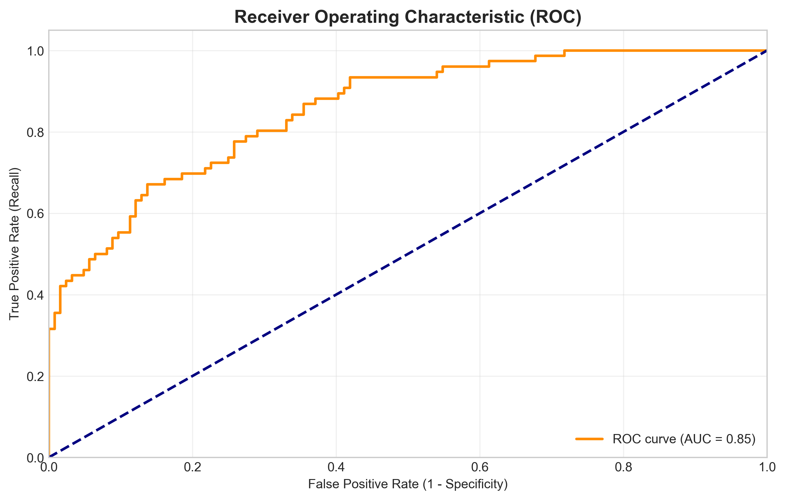
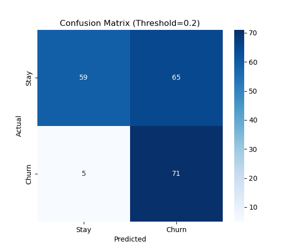

# 📉 电信客户流失预警系统 (Telecom Churn Prediction System)

[中文版](#chinese-version) | [English Version](#english-version)

---

<a name="chinese-version"></a>
## 中文版说明

### 1. 商业背景
在电信行业，获取新客的成本是挽留老客的 5-10 倍。本项目通过逻辑回归算法，对用户的在网时长、月费、投诉次数进行建模，旨在提前识别高危流失用户。
**核心业务逻辑**：放弃追求“全盘准确率”，通过下调分类阈值至 **0.2**，最大化提高**召回率 (Recall)**，确保流失风险不漏抓。

### 2. 数学框架
*   **模型假设**：$P(y=1|x) = \sigma(\mathbf{w}^T \mathbf{x} + b)$
*   **优化算法**：最小化**对数损失函数 (Log Loss)**，采用 L-BFGS 进行梯度寻优。
*   **标准化**：由于“月费”与“投诉次数”量级不同，采用 Z-Score 标准化消除量纲对权重的干扰。

### 3. 项目 Pipeline
1.  **数据模拟**: 生成 1000 条仿真数据，模拟特征间的线性概率关系。
2.  **可视化分析**: 绘制损失函数收敛曲线、ROC 曲线。
3.  **权重洞察**: 分析模型系数，定位影响流失的核心因子。

### 4. 模型表现
*   **ROC-AUC**: 0.85
*   **核心发现**: 投诉次数 (ServiceCalls) 是流失的正相关核心因子，而在网时长 (Tenure) 是强抑制因子。



---

<a name="english-version"></a>
## English Version

### 1. Business Context
In the telecom industry, customer acquisition costs are 5-10x higher than retention. This project utilizes Logistic Regression to build a predictive model based on customer behavior (Tenure, Monthly Charges, Service Calls).
**Strategic Goal**: Shift focus from overall accuracy to **Recall**, using a tuned threshold of **0.2** to capture as many potential churners as possible for proactive retention campaigns.

### 2. Mathematical Framework
*   **Model**: $P(y=1|x) = \sigma(\mathbf{w}^T \mathbf{x} + b)$
*   **Loss Function**: Minimizing **Log Loss (Cross Entropy)** using the L-BFGS optimization algorithm.
*   **Preprocessing**: Applied **StandardScaler** to prevent features with larger scales (MonthlyCharge) from dominating the gradient updates.

### 3. Pipeline Steps
1.  **Simulation**: Generated 1000 synthetic samples based on predefined coefficient weights.
2.  **Visualization**: Tracking Loss convergence and the Trade-off between Precision and Recall.
3.  **Insight Extraction**: Ranking features by their standardized coefficients.

### 4. Results
*   **ROC-AUC Score**: 0.85
*   **Confusion Matrix**: High sensitivity to Churn cases (Threshold=0.2).



---

## 🛠️ 如何运行 (How to Run)

1. **Install Dependencies**:
   ```bash
   pip install -r requirements.txt
```
##  署名
```bash
林明超  数学与应用数学  2026年1月30日
```
